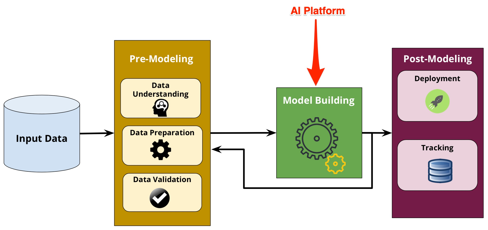
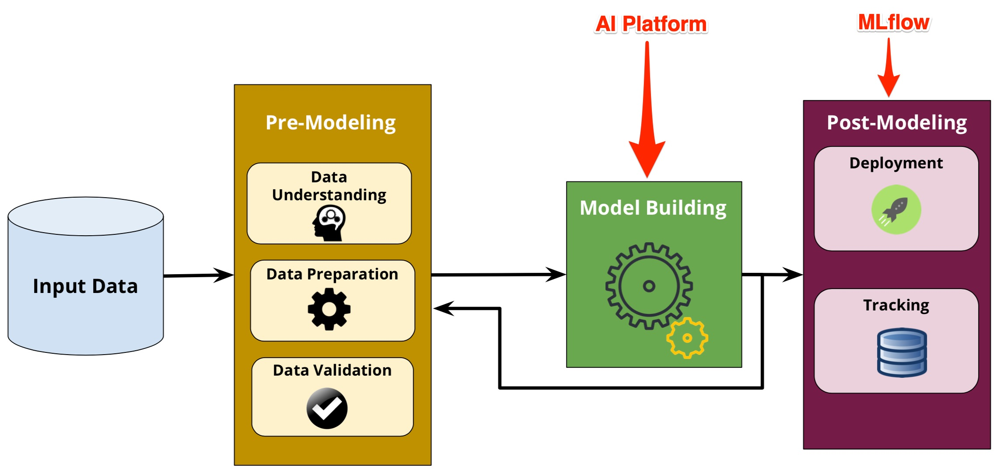

# AI Platform

## Background

Artificial intelligence (AI) gig economy is here. Many companies including Uber, DoorDash, Fiverr built economies by relying on contingent workers, available on-demand. The great paradox of on-demand services is that they can be easily automated using AI technologies.

- Where do AI systems come from? Research and development (R&D)
- What do AI systems do today? Perform tasks (i.e. provide services)
- What will AI systems be able to do? Automate human tasks (and more)
- What is R&D? Tasks to automate
- Where does AI R&D automation lead? Recursive technology improvement
- Where does that lead? AI services, which includes the service of developing new services

> "The AI explosion will be enabled by AI-driven AI developments. As AI technologies are being recursively improved, new AI services and new AI tasks will be solved."
>
> -- Slava Kurilyak, Founder / CEO at Produvia

## About



**AI Platform** aims to automate AI R&D tasks. Our vision is to create machine learning models to solve various computer science tasks. Our mission is to achieve automation of AI technologies.

> "We need to standarize AI solutions by focusing on solving AI R&D tasks while developing machine learning models that are reusable and easily accessible by all."
>
> -- Slava Kurilyak, Founder / CEO at Produvia

**What is our approach?**

We are developing service-centered or task-focused machine learning models. These models, or AI services, solve distinct tasks or functions.

Examples of AI tasks include:

- semantic segmentation (computer visions)
- machine translation (natural language processing)
- word embeddings (methodology)
- recommendation systems (miscellaneous)
- speech recognition (speech)
- atari games (playing games)
- link prediction (graphs)
- time series classification (time series)
- audio generation (audio)
- visual odometry (robots)
- music information retrieval (music)
- dimensionality reduction (computer code)
- decision making (reasoning)
- knowledge graphs (knowledge base)
- adversarial attack (adversarial)

**Proposed Folder Structure:**

We store machine learning models using the following folder structure:

`/tasks/area/task`

For example:

`/tasks/computer-vision/image-classification`

## Installation

To get the entire project up and running locally:

Clone the repo:

```
$ git clone https://github.com/produvia/ai-platform.git
$ cd ai-platform
```

## Running Locally

This is an example of how to run `object detection` on the picture containing zebra:

```
$ cd tasks/computer-vision/object-detection/
$ mlflow run . -P photo_name=zebra.jpg
```

## Project Components

For more information, check out documentation for the different services:

- [/tasks](https://github.com/produvia/ai-platform/tree/master/tasks) - for compilation of AI tasks

## Supported Programming Languages

AI Platform supports various programming languages:

<a href="https://www.python.org/"></a> <a href="https://www.r-project.org/"></a> <a href="https://en.wikipedia.org/wiki/Java_(programming_language)"></a>

## Supported ML Development Frameworks

AI Platform supports various machine learning frameworks and libraries:

<a href="https://tensorflow.org/"></a> <a href="https://pytorch.org/"></a> <a href="https://keras.io/"></a> <a href="https://spark.apache.org/"></a> <a href="https://scikit-learn.org/"></a> <a href="https://www.h2o.ai/"></a>

## Supported ML Deployment Frameworks

AI Platform supports various machine learning deployment frameworks and libraries:

<a href="https://conda.io"></a> <a href="https://www.docker.com/"></a> <a href="http://mleap-docs.combust.ml/"></a> <a href="https://aws.amazon.com/sagemaker/"></a> <a href="https://azure.microsoft.com/en-ca/services/machine-learning-service/"></a> <a href="https://cloud.google.com/"></a>

## Common Questions

### What is the difference between AI Platform and MLflow?

AI Platform is an open source platform for automating machine learning models (aka tasks) while MLflow is open source platform for the machine learning lifecycle. AI Platform focuses on automating tasks while MLflow focuses on managing and deploying models. AI Platform focuses on automating model building. MLflow focuses on automating post-modeling. AI Platform is dependent on MLflow. MLflow is not dependent on AI Platform.

AI Platform:

> AI Platform Tasks: Automate computer science tasks using AI, machine learning, deep learning and data science.

MLflow:

> MLflow Tracking: Log parameters, code, and results in machine learning experiments and compare them using an interactive UI.
>
> MLflow Projects: A code packaging format for reproducible runs using Conda and Docker, so you can share your ML code with others.
>
> MLflow Models: A model packaging format and tools that let you easily deploy the same model (from any ML library) to batch and real-time scoring on platforms such as Docker, Apache Spark, Azure ML and AWS SageMaker.

### What is the difference between AI Platform and AutoML?

AI Platform aims to make machine learning models reusable and easily accessible by all.

Automated machine learning (autoML) is a computer science methodology which aims to make machine learning more accessible. AutoML automatically generates data analysis pipelines, performs neural architecture search, hyperparameter optimization and automated feature engineering.

### What is the difference between AI tasks and human tasks?

AI tasks are computer tasks solved using AI and machine learning. Unautomated AI R&D tasks are human tasks. Advances in AI will enable incremental speedup and automation of human tasks.

## Datasets

### Uploading Your Own Dataset

Do you have your own data? We recommend that you upload your own dataset onto a public bucket via [AWS S3](https://aws.amazon.com/s3), or [Google Drive](https://drive.google.com) and include a `LICENSE` file which describes usage rights (commercial or non-commercial).

### Finding an Existing Dataset

Are you looking for a dataset? We recommend that you check out [DataSetList.com](https://www.datasetlist.com/) which includes the biggest machine learning datasets for computer vision (CV), natural language processing (NLP), question answer (QA), audio, and medical industries. You can also search for particular datasets using [Google Dataset Search](https://toolbox.google.com/datasetsearch).

## Contributing

### Code

Do you want to contribute towards **AI Platform**?

1. Fork this repo ([how to guide](https://help.github.com/en/articles/fork-a-repo)).
2. Develop a new machine learning model or improve an existing one. Review existing [tasks](https://github.com/produvia/ai-platform/tree/master/tasks) and outstanding [issues](https://github.com/produvia/ai-platform/issues) and [pull requests](https://github.com/produvia/ai-platform/pulls).
3. Integrate [MLflow](https://github.com/mlflow/mlflow) into your code.
4. Create a pull request from your fork ([how to guide](https://help.github.com/en/articles/creating-a-pull-request-from-a-fork)).

### Ideas

Do you have an idea, feature request, or task request for **AI Platform**?

1. Create a [new issue](https://github.com/produvia/ai-platform/issues/new/choose)
2. Email the Produvia team at [hello@produvia.com](mailto:hello@produvia.com)

## Project Dependencies



- At **AI Platform**, we use [MLflow](https://github.com/mlflow/mlflow) for model tracking and model deployment. MLflow is an open source platform for machine learning lifecycle. Familiarize yourself with MLflow by going through the following resources:
	1. Review [MLflow examples](https://github.com/mlflow/mlflow/tree/master/examples) hosted on Github.
	2. Watch [MLflow intro video on YouTube](https://www.youtube.com/watch?v=QJW_kkRWAUs) by Matei Zaharia, Co-founder and Chief Technologist at Databricks.
	3. Watch [MLflow videos on YouTube](https://www.youtube.com/playlist?list=PLTPXxbhUt-YVstcW1-OrYoRiAipXRManO)

## About Produvia

Since 2013, [Produvia](http://produvia.com) has partnered with companies from all industries to accelerate the adoption of AI and machine learning technologies.
