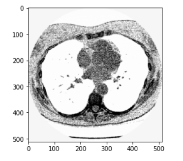
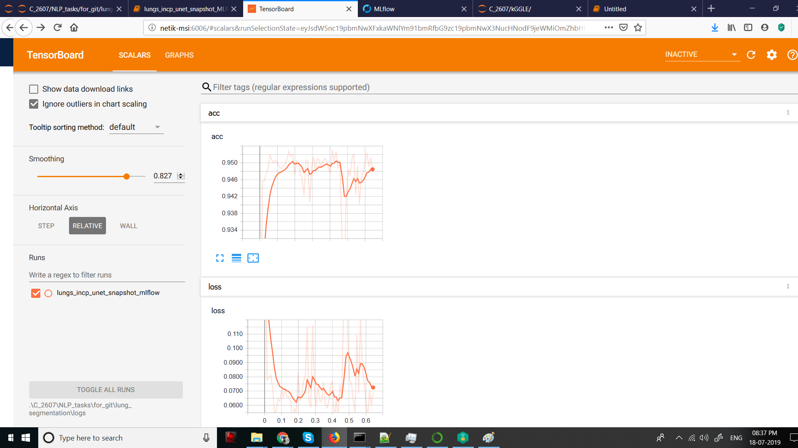
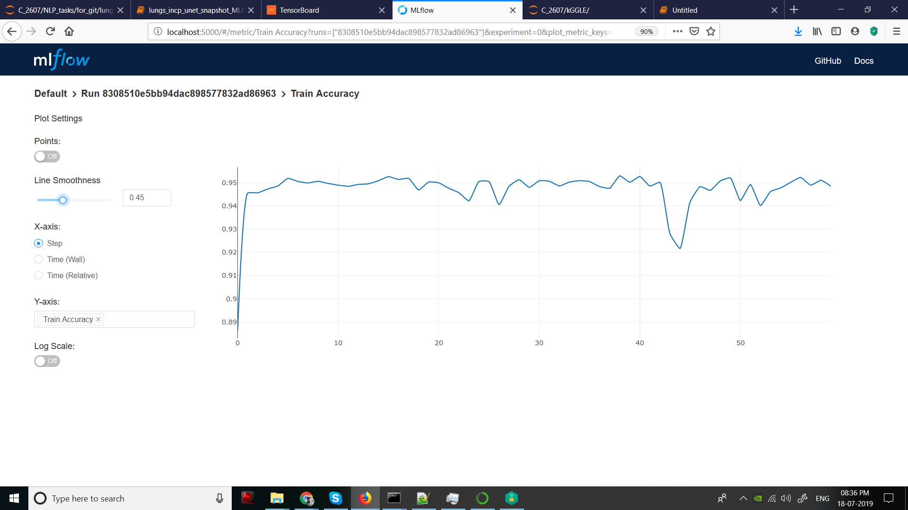

# Semantic Segmentation

Semantic segmentaion or Pixel wise segmentation is a task in which each pixel in the image are classified into 2 or more classes.
In this notebook we need to classify pixels of image into just 2 classes and hence the output needed for this task is a black white mask of the object of interest.

## Packages used

keras, sklearn, tensorlfow, tensorboard, numpy, pandas, cv2, matplotlib, MLflow

## Dataset

For showing comparison study in the task of Image Segmentation, a dataset where we need to segment lesions from the CT scans of lungs. 

There are total 267 CT scans of lungs corresponding with the manually labelled segmented masks.

  

[Here](https://www.kaggle.com/kmader/finding-lungs-in-ct-data/home) is the link to the dataset.

## Usage

Make sure you have the above mentioned packages installed in your environment and you have dowloaded and extracted the dataset at semantic-segmentation folder.

Download the reposritory, and in a cmd prompt navigate to the folder semantic-segmentation and run:

`mlflow run seg_mlflow --no-conda`

`--no-conda` option is given if you want to run the project in your existing environment. If you want to create a new environment omit this option.

For viewing the mlflow ui open another cmd prompt and navigate to the folder semantic-segmentation and run:

`mlflow ui`

*Note For running Mlflow ui in windows go to the last comment in the link-> https://github.com/mlflow/mlflow/issues/154 

For viewing Tensorboard ui open a cmd prompt and run:

`tensorboard --logdir="PATH\TO\LOGS"`

For passing parameters to the programs run cmd :
`mlflow run seg_mlflow --no-conda -P PARAM_NAME_1=PARAM_VALUE_1 -P PARAM_NAME_2=PARAM_VALUE_2`

Here are the available parameters:

Options:
  --image_path TEXT       Path to images folder
  --annotation_path TEXT  Path to annotations folder
  --weights_path TEXT     Path to base model weights file
  --log_dir TEXT          Path to store log files
  --initial_lr FLOAT      Initial learning rate
  --batch_size INTEGER    Batch size for training
  --seed INTEGER          numpy random seed

## Folder Structure

semantic-segmentation     
                     finding-lungs-in-ct-data
                                             finding-lungs-in-ct-data
                                                                     2d_images
                                                                     2d_masks
                     seg_mlflow
                     weights
                     logs
## Model Architecture

Here an autoencoder model with the [U-Net](https://arxiv.org/abs/1505.04597) architecture is used. [Inception](https://arxiv.org/abs/1512.00567) blocks are used to extract the features and learning rate is consine annealed for more efficient training. MLflow is used for logging parameters, metrics and models. 

An inception block looks like:

## Results

When running the model with 8 snapshots and 1600 epochs model IOU over randomly chosen (seed of 3) test-set was 97.71

Here are the sample windows from tensorboard and MLflow.

  

